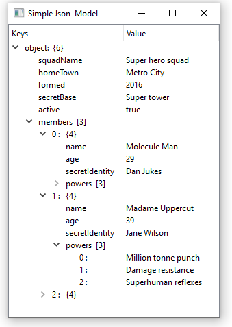

QJsonOrderedModel is a Qt5/Qt6 tree model class for Json data.




**Usage:**

The Json data can be load using the constructor 

```c++
    explicit QOrderedJsonModel(const QString json_input, QObject *parent = nullptr);
```

or the function 

```c++
    void load(const QString & jsonInput);
```

Json input string can be validate using the function:

```c++
    bool validateJsonInput(const QString & jsonInput);
```

**Example**

```c++
const QString jsonInput =  ....[any valid json input ]
QOrderedJsonModel model;
model.parse(jsonInput);

QTreeView view;
view.setModel(&model);
view.setWindowTitle(QObject::tr("Json Ordered Model"));
    view.show();
```


**Notes**

- QJsonOrderedModel use  nlohmann:json as internal json parser. 
- Only **UTF-8** encoded input is supported which is the default encoding for JSON.
- The strings stored in the library are UTF-8 encoded.  nlohmann:json use  std::string for a string types. but conversion to/from QString are handled by the class.
- Comments are not part of the [JSON specification](https://tools.ietf.org/html/rfc8259).  Comments will then be treated as whitespace.
- QOrderedJsonModel want to preserve the insertion order. This is **NOT** a standards-compliant. 
